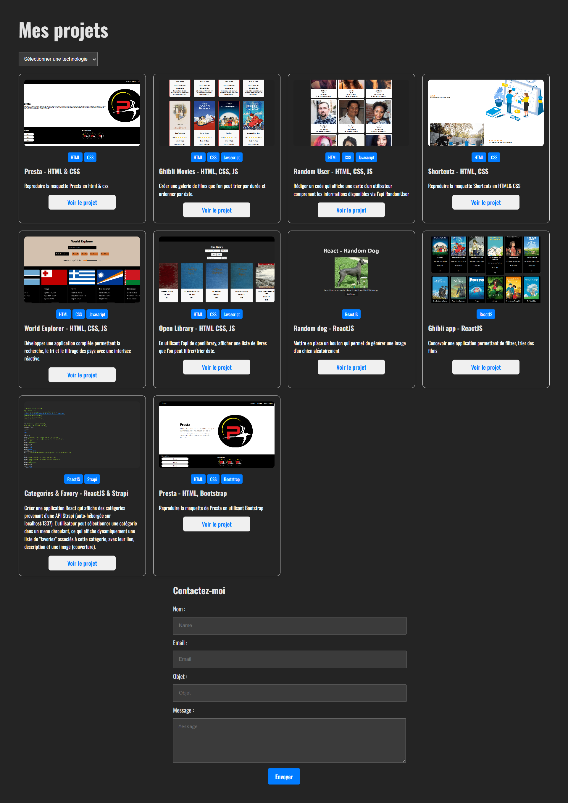

# 🎨 React Portfolio with Strapi Backend

## 📝 Project Description

This project is a personal portfolio built with **React.js** on the frontend and **Strapi** on the backend.
It displays a list of projects dynamically retrieved from a Strapi API, filterable by technology, and includes a functional **contact form** that:

- Stores messages in Strapi
- Sends an email via **EmailJS**

This combination allows for both instant communication and persistent data storage in your CMS.

## 🎯 Objectives

- Enable project consultation via a custom API
- Provide a seamless and responsive user experience
- Offer dynamic filtering by technology used
- Integrate a secure contact form connected to a database and email system

## 🧠 Key Features

- Dynamic project display with cover image and technology badges
- Real-time project filtering by selected technology
- Contact form :
  - Field validation
  - Save to Strapi database
  - Automatic email notification (via EmailJS)
- Responsive interface suitable for desktop, tablet, and mobile devices

---

