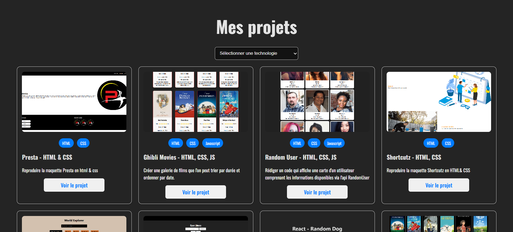

# 🎨 React Portfolio with Strapi Backend

## 📝 1. Project Description

This project is a personal portfolio built with **React.js** on the frontend and **Strapi** on the backend.
It displays a list of projects dynamically retrieved from a Strapi API, filterable by technology, and includes a functional **contact form** that:

- Stores messages in Strapi
- Sends an email via **EmailJS**

This combination allows for both instant communication and persistent data storage in your CMS.

## 🎯 Objectives

- Enable project consultation via a custom API
- Provide a seamless and responsive user experience
- Offer dynamic filtering by technology used
- Integrate a secure contact form connected to a database and email system

## 🧠 Key Features

- Dynamic project display with cover image and technology badges
- Real-time project filtering by selected technology
- Contact form :
  - Field validation
  - Save to Strapi database
  - Automatic email notification (via EmailJS)
- Responsive interface suitable for desktop, tablet, and mobile devices

---

## 🏗️ 2. Technical architecture
```txt
📁 docs/ # Auto-generated documentation (JSDoc)
📁 public/
📁 src/
├── App.jsx         	    # Main component
├── ContactForm.jsx 	    # React component for the contact form
└── ...
📄 jsdoc.json 				    # JSDoc configuration
📄 jsdoc.conf.json		    # A tool that automatically generates HTML documentation
📄 .env 						      # Environment variables for EmailJS
📁 strapi/ 						    # Strapi backend project (optional)
```

**Data flow:**

1. User submits the contact form
2. `ContactForm.jsx`:
   - Sends form data to Strapi: `POST /api/contacts`
   - Sends an email using `emailjs.sendForm(...)`
3. Displays success/error feedback to the user

Key components :
- [`App.jsx`] : Retrieves and displays projects with filters by technology.
- [`ContactForm.jsx`] : Manages form submission to Strapi and EmailJS.

---

## 3. Technologies used

| Layer             | Technologie      | Rôle / Description                                                    |
|-------------------| ---------------- | --------------------------------------------------------------------- |
| Frontend UI       | **React**        | Bibliothèque JavaScript pour construire l’interface utilisateur       |
		    | **CSS**          | Mise en forme manuelle avec fichiers en CSS                           |
|-------------------| ---------------- | --------------------------------------------------------------------- |
| Contact Workflow  | **EmailJS**      | Service d’envoi d’emails côté client sans serveur SMTP                |
|-------------------| ---------------- | --------------------------------------------------------------------- |
| Backend CMS       | **Strapi**       | CMS headless utilisé comme backend pour gérer les projets et contacts |
                    | **Node.js**      | Runtime JavaScript utilisé par Vite et pour exécuter Strapi           |
                    | **SQLite**       | Base de données par défaut de Strapi                                  |
|-------------------| ---------------- | --------------------------------------------------------------------- |
| Documentation     | **JSDoc**        | Générateur de documentation à partir des commentaires du code         |
|-------------------| ---------------- | --------------------------------------------------------------------- |
| Build Tool        | **Vite**         | Outil de build ultra rapide pour le développement React               |


